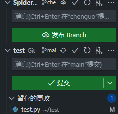

# Day1 Linux、VScode与Git

```{article-info}
:avatar: https://avatars.githubusercontent.com/u/163944337
:avatar-link: https://github.com/WinstonCHEN1/
:avatar-outline: muted
:author: [@WinstonCHEN1](https://github.com/WinstonCHEN1/)
:date: June, 30, 2024
:read-time: 10 min read 
:class-container: sd-p-2 sd-outline-muted sd-rounded-1
```

## 一、Basic Linux


### 1. 文件和目录管理

列出当前目录下的文件列表
```
ls
```

显示当前工作目录的路径
```
pwd
```

进入目录

```
cd /path/to/directory（请替换需要进入的路径）
```

显示磁盘结构，包括各个磁盘的挂载点

```
lsblk
```


### 2. 系统监控和任务管理


显示任务管理器，监控系统进程

```
top
```

美化版的top，提供更直观的任务管理界面

```
btop
```


### 3. 清理屏幕

清空当前终端页面
```
clear
```

### 4. 网络和系统信息

查看curl命令的文档

```
man curl
```


查看当前IP地址

```
curl ip.sb
```

使用curl测试网络连接，使用谷歌可查看是否能访问外网
```
curl baidu.com
curl google.com
```

显示每个接口的详细信息
```
ip a
```

### 5. 文件传输和安装

使用scp命令进行文件传输

```
scp file.txt username@remotehost:/path/to/destination/
```


### 6. VIM快捷键
向下移动

```
J
```
向上移动
```
K
```
退出VIM（组合键）
```
esc
:q
```

### 7. Python和虚拟环境管理
创建Python虚拟环境，用于隔离项目的依赖环境
```
virtualenv venv
source activate venv/bin/activate

```


## 二、VScode


### Extension


#### 1.Remote
安装Remote插件, 然后进行服务器的登录操作


#### 2.简体中文
如果不习惯看英文，可以安装简体中文的插件


#### 3.Python
VSCode中Python开发环境支持的插件


### VSCode连接服务器
在安装好remote插件后，就可以连接到服务器了。

点击这个按钮：


左边栏空空如也，点击这个加号按钮：


输入ssh连接命令：


现在假设已经添加好了，点击刷新，左边就可以进行连接了。

这里用挂在校园网上的服务器举例：


点击箭头，顶端搜索栏中会要求输入密码，输入正确后即可连接。

此时点击左边的资源管理器，画面如下：


点击打开文件夹，就可以进入服务器中的文件夹了。

在你有权限的文件夹中，你可以进行文件的增删改等操作，请根据服务器不同位置的具体权限自行使用。


## 三、Git
首先请确保你的电脑已经安装了Git！

Git的安装网址如下：
[git-scm](https://git-scm.com/book/zh/v2/%E8%B5%B7%E6%AD%A5-%E5%AE%89%E8%A3%85-Git)

如果你是MacOS系统，可以使用brew进行安装。

首次使用需要在命令行对个人信息进行初始化：
```
git config --global user.name 你的用户名
git config --global user.email 你的邮箱
```
这里的邮箱需要与你注册github的邮箱对应。为了方便，用户名和邮箱都使用Github的注册信息即可。

````{note}

如果你不想要重复输入密码，可以考虑使用:

cache 10800秒，之后失效, 默认15分钟

```bash
git config --global credential.helper 'cache --timeout=10800'
```
store, 永久有效，安全性欠佳

```bash
git config --global credential.helper store
```
````


### 命令行操作

如果你要把Github上的项目克隆到本地，分两种情况，操作都大同小异。

在后文，项目统一用repo代替，与github的repositories对应。

#### 一、repo是你自己创建的/你参与协作且拥有访问权限

进入自己的repo，点击绿色的Code按钮，会找到一个https网址，把它复制下来。用这行代码克隆到你初始化的仓库，url即复制的网址。访问Github可以使用科学上网。

```git clone 复制的url```

命令行会反馈是否成功，如果不成功可能是网络问题。

#### 二、repo是别人的，你想搬运来用
点击Fork按钮，将项目fork到你自己的repo中，随后在自己的repo中查看url并使用相同的命令。网址后的ID是你自己的才是正确的。

举例：

现在，你可以在本地对这个项目进行操作。

这里需要注意项目的法律条款协议。

当操作完成后，需要将项目推送到GitHub时,命令行进入工作文件夹。

```
git add .
```

将文件夹中的所有文件添加到工作区

```
git status
```

查看当前工作区状态，可以查看经过修改的文件

```
git commit -m "your message"
```

将修改好的内容提交到工作区，your message部分是你的提交信息，日志会更新在这里

```
git push
```

将代码推送到GitHub，如果失败是网络问题。如果你要将你修改的代码提交到别人的repo中，第一次，要用到

```
git push --set-upstream origin
```

推送远程仓库，第一次可能需要登录。如果GitHub的仓库更新了，比如和别人共同协作一个repo，他提交了代码，你要同步

```
git pull
```
拉取最新的代码
如果在repo中有不同的分支
```git branch 分支名```
创建本地分支

```
git checkout -a
```

查看本地的所有分支
```
git checkout 分支名
```

切换到某分支
```
git branch - D 分支名
```

删除本地分支

```
git remote add origin url
```

将本地分支同步到远程分支

### VSCode中源代码管理


页面的左侧工具栏自上往下第三个是源代码管理，在这里可以对你代码的修改提交进行管理。

例如我对我的代码进行了修改，在源代码管理处就能看到我进行的修改。


点击修改文件右边的加号，把修改提交到暂存区。



在将所有需要提交的文件提交到暂存区后，请输入修改信息，例如：


这里的修改信息请遵守规范。

编辑好信息后确认无误，请点击提交。


点击同步更改，即可将提交的更改进行推送。

界面的最上面，会有这个图标，请善用：


这里简单进行一下解释，可以参考上文的命令行操作进行比对。

- 拉取（pull）：如果你的代码版本和main分支下的代码不同，或者是有新的更新要从代码仓库拉取，请使用**拉取**
- 推送（push）：在提交了更改后，使用**推送**将代码推送到所在的分支
- 克隆（clone）：从URL**克隆**整个代码仓库到本地
- 签出到（branch）：**切换**分支
- 抓取（fetch）：与pull不同之处在于，fetch会下载远程分支的所有更新，但不会自动合并到本地分支

### 代码提交操作步骤

1. 将仓库克隆到本地目录
2. 切换到正确的分支，对代码进行修改
3. 将所有要提交的修改添加到暂存区
4. 确认无误后，提交修改，编辑符合规范的提交信息
5. 将已提交的修改推送到远程仓库。如果分支需要合并，请在GitHub提交合并请求，由项目负责人检查代码后进行操作。如果推送到自己的分支，自己进行确认即可。
