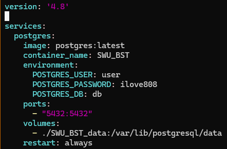

# Day5 Docker与Scrapy爬虫项目

```{article-info}
:avatar: https://avatars.githubusercontent.com/u/163944337
:avatar-link: https://github.com/WinstonCHEN1/
:avatar-outline: muted
:author: [@WinstonCHEN1](https://github.com/WinstonCHEN1/)
:date: June, 30, 2024
:read-time: 10 min read 
:class-container: sd-p-2 sd-outline-muted sd-rounded-1
```

## Docker

为了避免换了不同的设备你仍然需要配置相同的开发环境，程序员们集思广益开发了**Docker**，这是一种轻量级的虚拟化技术，主要为了实现一个目标：无论你是什么系统、什么设备，我们都能在虚拟层面上获得一个相同的开发环境，而且能很好的实现扩容迁移。此外，Docker比较安全，即使Docker崩了也不影响你本身的操作系统。

当我们在服务器上遨游的时候，我们常常会遇到装一个东西需要`sudo`权限，这时候老师会说，root不能给，对于泛用的东西可以帮你装，但你自己的，差不多得了。Docker同样可以解决这个问题，使用虚拟环境。

Docker默认装在`root`上，可以参考网上Docker的官方文档中Docker rootless有关的部分。

```
dockerd-rootless-setuptool.sh install
```

这时候，我们可以用最简单的一串代码感受以下Docker的工作流程：

```
docker run hello-world
```
然后，Docker开始工作，从镜像库里拉取镜像，创造了一个新的容器，执行了一些操作，把这些输出推到了你现在看到的终端，大概是这样的：


使用`docker run -it ubuntu bash`之后启动了容器，会发现你变成了`root`，因为你已经进入了这个容器了。

- 查看当前正在运行的容器：`docker ps`
- 查看已安装的镜像:`docker image <command>`可以查看各种方法

这里以mongoDB为例，docker安装MongoDB有两种办法：
- 第一种 命令行直接安装

```
docker pull mongo:latest
```

- 第二种 docker desktop中搜索安装

 
 
 点pull安装。
 
安装好之后，用以下命令启动mongo

```
docker run -d -p 27017:27017 --name my-mongo-container mongo
```

-  -d: 后台运行容器。
-  -p 27017:27017: 将主机的27017端口映射到容器的27017端口。
-  --name my-mongo-container: 为容器指定一个名字，这里是my-mongo-container，你可以根据需要更改。

用以下命令进入mongoDB容器的bash

```
docker exec -it my-mongo-container bash
```

进入bash之后，可以用这个命令连接mongodb

```
mongosh --host 127.0.0.1 --port 27017
```

- 停止容器:`docker stop my-mongo-container`
- 删除容器:`docker rm my-mongo-container`

## Docker compose

我们可以通过docker compose很轻松的管理容器。

比如，这是一个docker-compose.yml的示例程序



这里注明了很多信息，比如容器的镜像服务，服务的细则。这里我拉取的是postgresql数据库的镜像，所以有管理员用户、密码等等。

里面比较重要的是：

- port：映射关系，如5432：5432，将本地的5432端口映射到服务器的5432端口
- volumns：磁盘的映射，存到啥地方

那么，现在写好了这个程序（~~不会写也没关系，有AI和万能的搜索引擎嘛~~），你就可以开始体验这个工具了。

- `docker compose up`让你的容器跑起来，当然，跑的是`docker-compose.yml`的那个容器。
- `docker compose up -d`可以让容器跑在后台。
- `docker compose down`关闭容器。

同样的，现在你可以使用`docker ps`看看这个新容器有没有成功运行起来了。

## Scrapy爬虫

1. 从零开始，新建一个repo。
2. 克隆repo到本地，django初始化一下，要利用django进行储存。
3. 分析一下网页，比如说小红书就有很多的card。我们分析卡片内容大概是包在一个id叫做noteContainer的盒子里面。项目包括几个部分，note，用户，以及用户发的东西。用户对应profile，小红书号，IP地址，简介。
4. 设计数据库储存信息：
    - 用户url，CharField。对于url，让它做主键（唯一）,而且主键不能为空！！所以这里不需要设置为空，下面的要。
    - 用户ID，先观察下是不是所有的ID都是数字？这里关系到要设计成纯数字还是字符串。根据观察发现，可能也有字符，所以要设计成字符串。这里对于一般的爬虫信息来说设置两个属性，blank（允许数据为空）和null（允许数据库为空）都为True，防止报错。
    - 用户IP归属地，字符串。
    - 用户简介的描述，这里可以把Field属性设置成TextField。
    - 头像，储存成URLField。
    - 用户的名字。
    - 上次更新时间，可以设置成DateTimeField。这是一个好习惯，此外，顺便最好要取一个TextField的content保存整个网页。
5. 做好了4这一步，记得django里面的settings设置一下用户等信息。然后`python manage.py migrate`，然后创建超级用户管理员。这些在昨天的note中都有提到。到这一步为止，数据库就建好了，可以直接通过web端的admin往里塞数据，当然这样很蠢，所以要写爬虫抓数据了。
6. 装playwright：`pip install pytest-playwright`
```
安装playwright，可以使用镜像，我这里全局都是清华镜像，下得很快。
pip config set global.index-url https://pypi.tuna.tsinghua.edu.cn/simple
python3 -m playwright codegen --help
有反馈，说明playwright安装成功
python3 -m playwright install
```
装好了内核之后就可以codegen,启动这个内核，比如`playwright codegen https://www.baidu.com/`

7. 接下来可以愉快的开始编写爬虫了，可以去playwright的官网copy一份模板。分析网页，编写代码。工程化一点的话，可以用虚拟环境，可以写`requirements.txt`里面放所需依赖，以后就可以直接`pip install -r requirements.txt`了。记得写版本！我们常用的库有```lxml,bs4,ipdb```（前提是同步）
