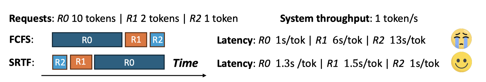
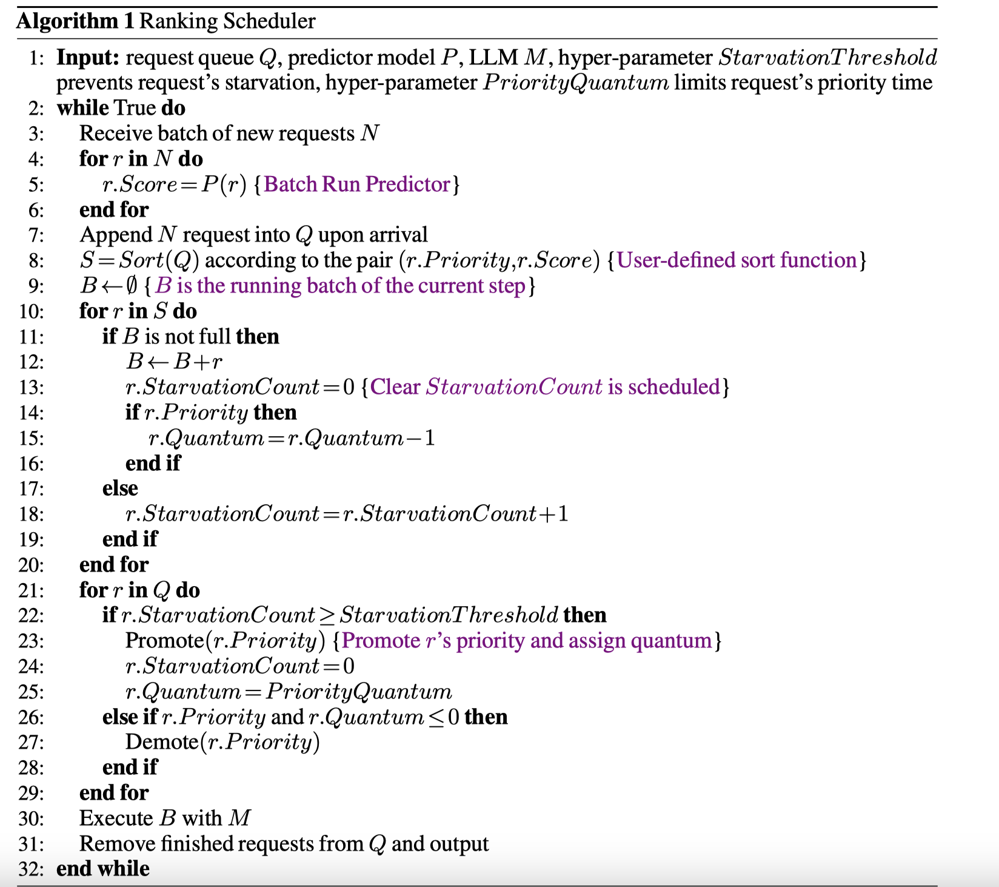
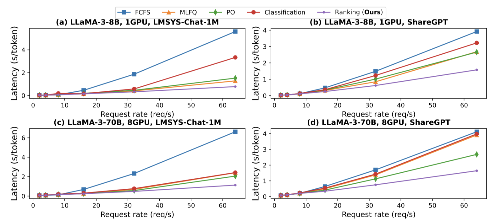
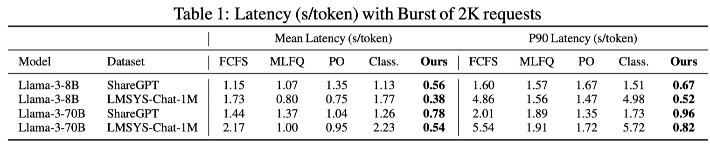
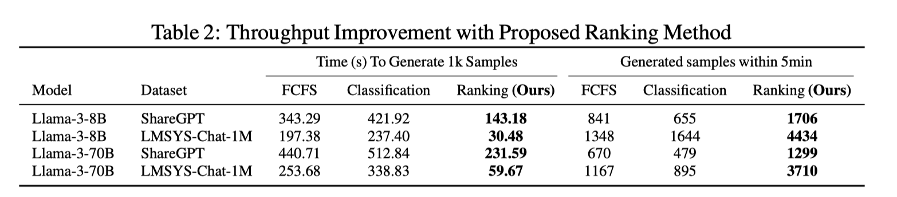

# Efficient LLM Scheduling by Learning to Rank
[Yichao Fu](https://scholar.google.com/citations?user=2zCW8IUAAAAJ),Siqi Zhu,Runlong Su,Aurick Qiao,Ion Stoica,[Hao Zhang](https://scholar.google.com/citations?user=H1d4BS8AAAAJ&hl=en)
## Introduction
Large language models (LLMs) are essential to modern Internet services, but as demand grows, efficient scheduling becomes crucial to maintain low latency and high throughput. Traditional scheduling methods like First-Come-First-Serve (FCFS) often lead to Head-Of-Line (HOL) blocking, causing high latencies, especially when long requests block shorter ones. While Shortest-Job-First (SJF) and Shortest-Remaining-Time-First (SRTF) can reduce latency, they require accurate knowledge of request lengths, which is challenging to predict.

  

This paper proposes that instead of knowing exact generation lengths, it is sufficient to understand their relative order. The Kendall rank correlation coefficient (Kendall’s Tau) is introduced to measure the similarity between predicted schedules and the ideal SJF/SRTF schedule, showing that higher similarity leads to lower latency. A learning-to-rank approach is then used to rank requests by their generation lengths, enabling on-the-fly scheduling with minimal overhead.

The proposed method significantly improves performance, reducing p90 latency by 2.8× for chatbot serving and increasing throughput for batch data generation by 6.5×, offering a simple and effective solution for LLM scheduling.

## Method
**1.Problem Formulation**

The goal is to approximate SJF/SRTF scheduling by predicting the ranking order of request generation lengths, rather than predicting the exact lengths. The ranking list is evaluated using Kendall’s Tau, where a higher Tau indicates a better alignment with the ground truth, leading to improved scheduling and lower latency. Since Kendall’s Tau is difficult to optimize directly, ListMLE, a listwise ranking loss, is used to train the predictor, ensuring a holistic evaluation of the ranking order and better correlation with the ideal SJF/SRTF execution.

**2.Generation length ranking predictor**

The proposed method uses a small OPT model as a predictor to rank prompts by their generation length for LLM scheduling. Instead of predicting exact lengths, the model predicts the relative ranking of requests. A linear layer is added to the OPT model to output a ranking score. Training data is generated by feeding prompts into a target LLM to obtain the full generation and its length, which is then ranked and used as the training label. To handle randomness in LLM generation, generation lengths are bucketed by increments of 10 to make the labels more robust. The OPT model is trained using ListMLE loss, optimizing for ranking rather than exact predictions. This approach improves robustness to noise, avoids issues with imbalanced datasets, and reduces overfitting risks compared to traditional classification-based methods.

**3.Request scheduling with rankings**

- **Rank scheduler**

The proposed algorithm schedules requests using ranking information. For each iteration, the predictor model scores the new requests, which are then sorted by their predicted generation lengths. A batch is formed based on the sorted list, respecting memory or batch size constraints. To prevent starvation of long requests, additional mechanisms are implemented. This ranking-based scheduling method is compatible with existing LLM serving techniques, such as continuous batching and PagedAttention.

- **Starvation Prevention**

Scheduling algorithms such as SJF/SRTF may cause starvation for long requests, resulting in prolonged wait times for users. To address this issue, a **max_waiting_time fairness** metric is proposed, which evaluates fairness at the per-request level, reflecting user satisfaction.

The **max_waiting_time** is defined as the maximum of **Time To First Token (TTFT)** and **Time Per Output Token (TPOT)**:

$$
\text{max\_waiting\_time} = \max(\text{TTFT}, \max(\text{TPOT}))
$$

This metric characterizes the maximum time interval between receiving two tokens after a request is sent. A higher max_waiting_time indicates more severe starvation, implying longer wait times for the user to receive a response.

To prevent starvation, a **starvation count** is maintained for each request. If a request is not executed during a scheduling step, its starvation count increases. Once the count exceeds a predefined threshold, the request's priority is promoted by allocating a "quantum" to it. After the allocated quantum is exhausted, the request is demoted back to its original priority.

This mechanism helps mitigate starvation, reduces **max_waiting_time**, and ensures better user satisfaction.

## Result
- **Chatbot Serving Scheduling**

The proposed ranking method is compared with four baseline methods on the ShareGPT and LMSYS-Chat-1M datasets, evaluating latency under increasing arrival rates. At a rate of 64 requests per second, the proposed method improves the mean latency by up to 6.9× compared to FCFS, and by 1.5×–1.9× compared to PO. Methods like MLFQ and PO experience significant Head-Of-Line (HOL) blocking, as they require running all requests for a certain duration to gather scheduling information. PO needs to execute all requests with the LLM to generate length predictions, while MLFQ runs all requests before progressing to the next priority. Unlike classification methods, which optimize for accuracy rather than ranking, the proposed method focuses on ranking, leading to better optimization. While both classification and the proposed method process all requests to obtain predictions, the OPT model used in the proposed method incurs less than 2% of the overhead, significantly reducing HOL blocking.

**Handling buristiness**. The proposed ranking method is evaluated against baselines under a burst of 2,000 requests, a common workload scenario in prior works. The results, presented in Table 1, demonstrate a significant improvement in latency. The proposed method reduces the mean latency by up to 2.0× and improves the P90 latency by up to 2.8× compared to the PO baseline.

- **Synthetic Data Generation Scheduling**

### Synthetic Data Generation (SDG)

Synthetic data generation (SDG) has become a critical inference workload for LLMs, particularly due to their high data requirements. In SDG, short responses are often preferred for practical reasons, including cost efficiency and to mitigate evaluation metric bias caused by long generations. To address this, samples with shorter generation lengths are prioritized for training in specific scenarios.

The proposed method demonstrates improvements in generation throughput in scenarios where short responses are favored. Two experiments were conducted:
1. **Quantity Limit**: With a quantity limit of 1,000 requests to evaluate how long schedulers take to generate responses for 10,000 prompts.
2. **Time Limit**: With a time limit of 5 minutes to assess how many samples can be generated within that timeframe.

The results, shown in Table 2, reveal that the classification method fails to outperform FCFS due to its extra preprocessing cost and low ranking ability to recognize short requests. In contrast, the proposed method effectively prioritizes short requests, reducing generation time by 2.4×–6.5× for 1,000 requests and improving throughput by up to 3.2× in 5 minutes. However, in settings where short generations are not preferred, the improvement is less significant.

## Conclusion

This paper presents a method for training a predictor to learn the generation length ordering of LLM requests using learning to rank. A rank-based scheduler is implemented on top of vLLM, demonstrating substantial improvements across various tasks: a 2.8x reduction in latency for chatbot serving and a 6.5x increase in throughput for synthetic data generation. Due to its simplicity and low computational cost, the proposed method can be easily integrated into production-level LLM serving systems, helping to reduce serving costs while improving service quality.
