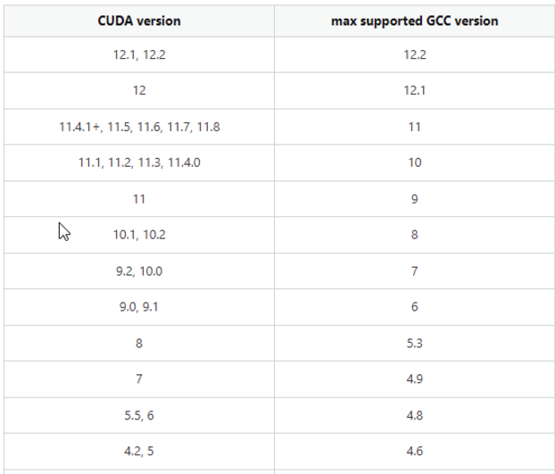
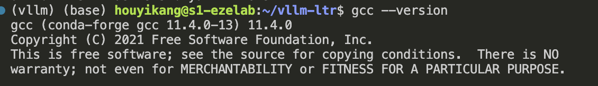

# 解决CUDA与GCC不兼容问题

在装环境时，我需要用cmake进行编译，我的cuda版本是12.1，而系统提供的是13.2，CUDA版本和GCC版本是不兼容的，下面提供了一个对应的版本，以供参考。


由于没有管理员权限，只能使用conda命令安装，从上图中可以看到，CUDA12.1能够兼容的GCC最高版本是12.2，我选择的是gcc11版本。

```
conda install gcc=11 gxx=11
```
安装之后，输入gcc --version，我们可以看到和图片中类似的结果，说明安装成功。

