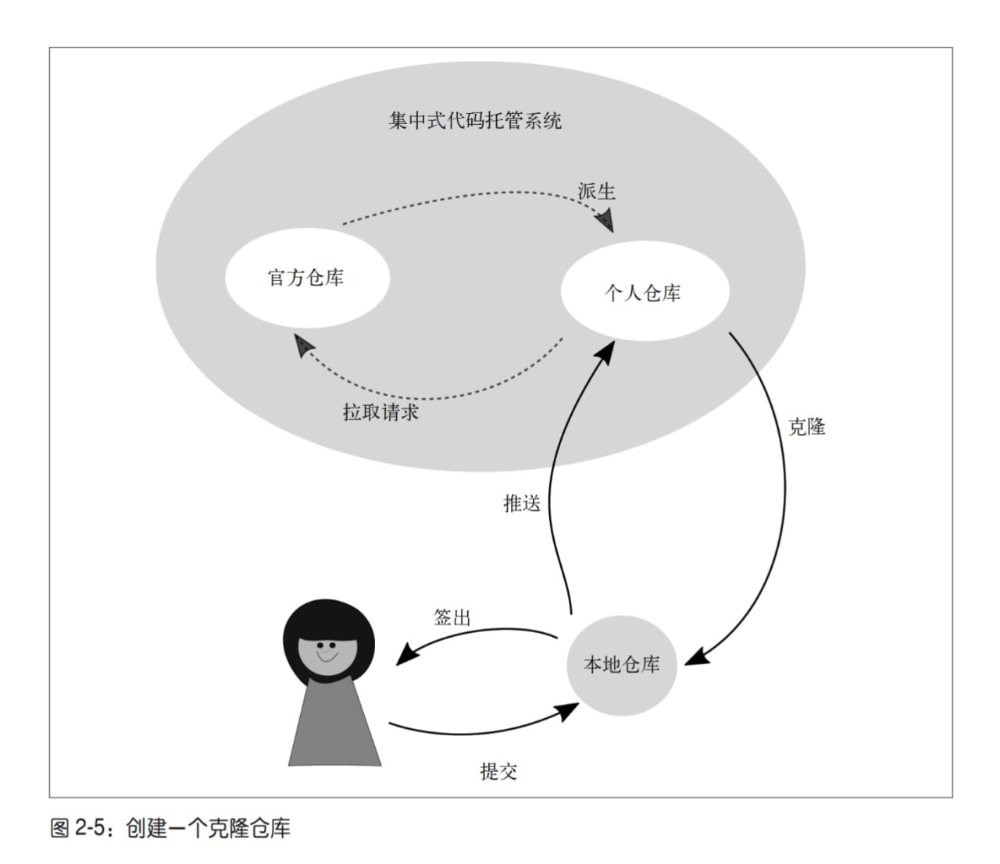
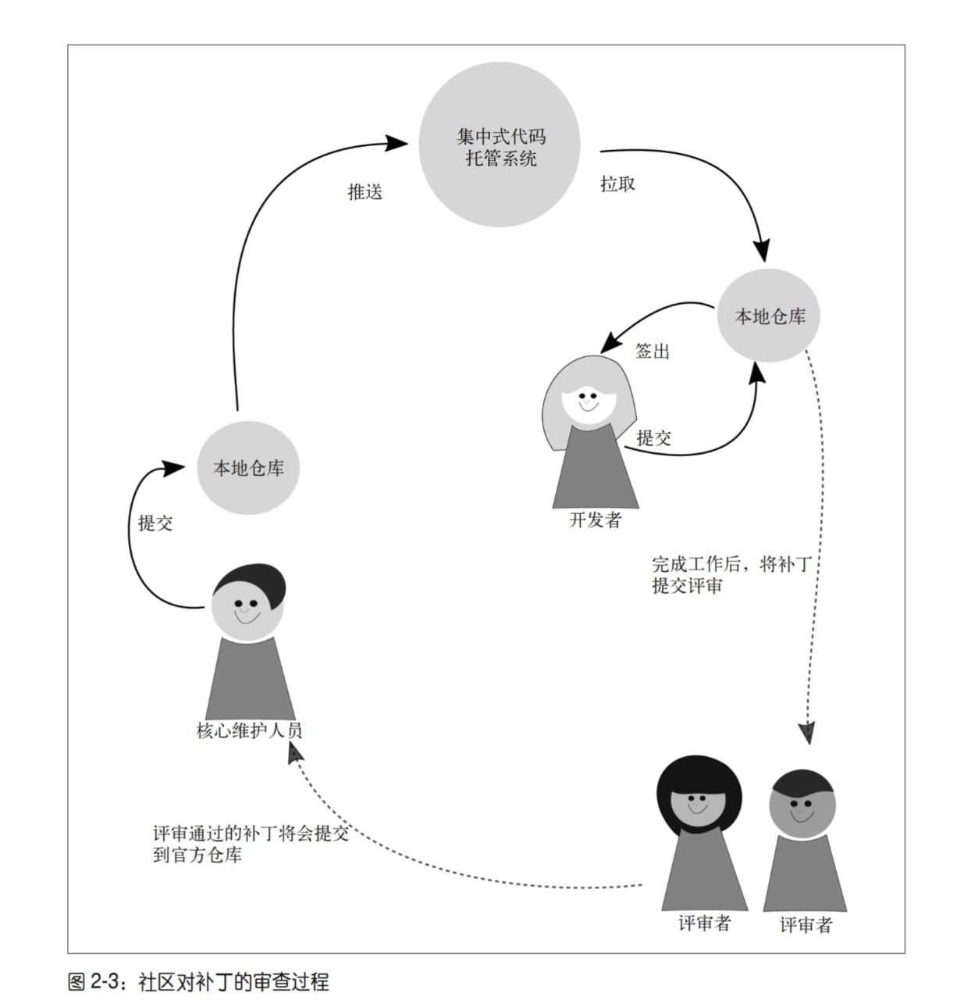
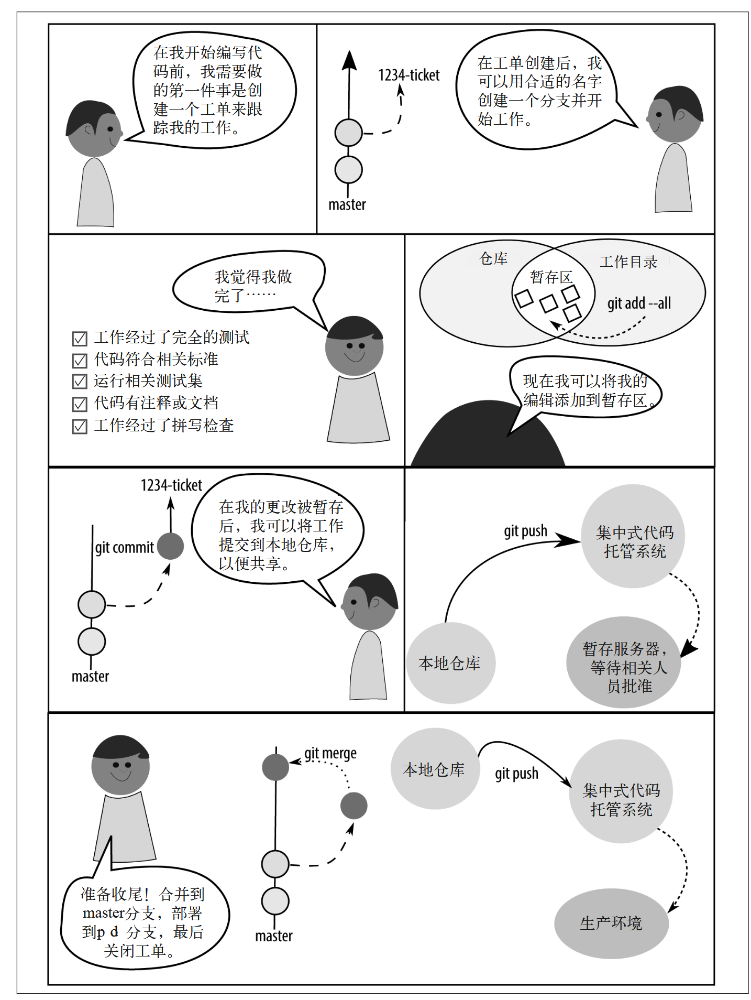
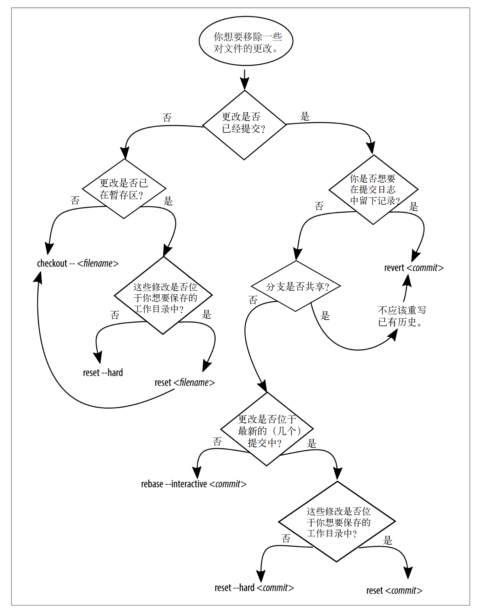

# Git for Teams

```{note}
This notes is extract from [Git for Teams by Emma Jane Hogbin Westby](https://www.oreilly.com/library/view/git-for-teams/9781491911204/), 更多详情请参看原文。
```

> 版本控制的重要性怎么强调都不为过。 我认为它的重要性不亚于黑板和书本的发明，因为它将众人的力量聚集在一起，从而创造了更大的价值。


## 第1章-团队作战

本章主要强调了在当代，软件工程的开发已经是团队作战，而非个人英雄主义。

> 在开始前，你必须理解你的团队以及软件需求。如果一开始团队就充满了信任和彼此关爱，当你计划用 Git 命令来达成目标时，将会发现自己一身轻松。

> 在充满信任的团队里， 当有人遇到困难时，你们可以互相帮助，人们在需要帮助时也会更加坦诚。当人们感受到支持，并理解为什么要用这些 Git 命令时，他们会更可能让 Git 为他们所用，而不是死记硬背几个命令，祈祷自己用对了.


安排一个会议, 在脑中熟记这个规律: **开场、参与、总结**。


> 项目开始后，你会希望定期与团队开个会。当你在分布式团队中工作时，逃避问题是非常容易的事。跟不上进度是一件很令人难堪的事，而且通常是一个复杂的问题。

> 保持沟通是 一个处理此类问题的好习惯，但这并不意味着要将所有时间浪费在开会上。成功的团队总是有着明确的目标。我喜欢一周一次的、非常短小的冲刺周期。在这么短的时间内很难隐藏什么问题。

当然，这些需要做更多的项目，并且自己是主导者而非参与者才能体会其中的奥妙。

关于Git，作者的描述也很有道理：

> 如果你尚未接触过分布式版本控制，会看到一些术语贯穿了本书剩下的部分。这些术语在简单的开发者工作流中最容易理解。 
> 每个开发者都有一个本地的仓库副本，即项目中的更改历史的独立副本。为了共享更改， 开发者一般会将一份仓库的副本发布到一个集中式的代码托管系统，如 GitHub。
> 尽管如此，正如你将在本章剩下的部分中了解到的那样，会有很多种分享代码的方法。 在仓库的中央副本中，开发者将会创建一个他们可以更改的仓库副本。在 Git 的用语中， 这个过程称为克隆副本，尽管这个过程也可以称为派生（forking）。
> 在克隆仓库时，软件开发者可以选择将他们的项目副本设置为私有的或公开的。一个私有 仓库默认不希望别人直接查看这个副本，而只通过查看主项目来获得被官方接受的更改。 
> 另一方面，任何人都可以直接向开发者的仓库的公开副本提交贡献。对于软件开发来说， 这是一个更加开放的策略，但可能会让人对哪个副本才是项目的起点感到困惑。

```{note}
当然，正确的区分Glossary：Git是一个软件，用来进行版本控制。Github只是一个托管平台，除了Github，还有GitLab，Gitee等。
```


## 第2章-命令与控制

> 版权是在使用和分发作品时排他且可转让的法律权利。世界各地的版权法律的细节不尽相 同，但一般来说作者有权复制和分发自己的作品。在开源软件中，版权所有者同意将他 们的作品授权给更多人

> 一旦你决定如何处置你项目的版权，接下来要做的便是创建一个分发许可.

版权和分发许可是分开的，版权一般和雇佣者和组织相关, 分发许可则是如何允许别人来分发你的项目。

项目运作有很多种方式：

1. 仁慈的独裁者（BDFL）： 代码库中任何地方的任何决定都由项目领导者说了算.DFL 类型的领 导者或许不会活跃于每次代码评审中，但最终保留了驳回或撤销某个决定的权力。例如 Linux

2. 共识驱动、主管批准： 共识模型鼓励社区在自己熟悉的领域中寻找合适的解决方案。当社 区对解决方案感到满意时，他们将这个 issue 标记为 RTBC［Reviewed and Tested by the Community，通过社区审核与测试，与 Ready to be Committed（即将提交）的英文缩 写相同］

3. 技术评审委员会或项目管理委员: 这种一般是那种比较大的项目，并且有funding支持的，例如Rust

### 日常的Git文件操作



### 社区驱动的Git


## 第3章-分支策略

> 在版本控制中，分支用于隔离一块代码上产生的不同想法。分支总是起源于代码库中的某 个特定节点。在第 2 章中我们谈到了派生和克隆仓库。分支类似于新工作开始时仓库内部 的分隔。创建分支时你可能想要将工作贡献回去，也可能想要隔离不同的工作。分支本身 并不关心跟踪的是什么更改！它们的职责仅仅是跟踪更改。 使用什么分支策略取决于你的发布管理流程。

开分支是多人开发的基础，不建议直接在main或者production等这些关键分支上进行提交。


> 分支允许你更改项目工作目录中可见的文件， 并且一次只会有一个分支活跃。大多数分支策略是根据粗粒度的想法分隔项目中的工作。 这个想法可以是软件的版本，比如，版本 1、版本 2、版本 3。这些软件版本或许能使你联 想到分支上正在进行的工作。根据它们代表的功能名称，这些想法被分隔在不同分支。这 些想法可能是一个 bug 修复或是一个新的功能，但它们也可以表示一个完整的小想法。

关于分支，就是从一个点切出去，然后开发自己的代码或者想法，甚至快速进行bug修复等。
> 约定是大家认同如何做一件事的标准

> 一种约定包含了两类分支：

+ **长期活跃的公开分支**： 长期活跃的分支扮演了代码中介的角色，并入大量开发者的贡献。
+ **短暂的私有分支**: 短暂的分支的 作用是隔离一个新想法的开发过程。这些新想法可以是一个 bug 修复、新增功能或实验性的重构。


几种约定:

1. 主线分支开发
2. 功能分支部署
3. 状态分支
4. 计划部署


> 在分布式版本控制系统 中，整合外部工作的方法与你选择的分支策略无关。更新分支时，你可以选择其中一种策 略：合并（merge）或变基（rebase）

> 通过远程引用更新跟踪分支的过程通常借助 pull 命令实现。然而，pull 是两个无关步骤 的组合：fetch 和 merge，或者 fetch 和 rebase。pull 命令默认使用 merge 策略来更新本地 分支，但是，通过添加 --rebase 参数

这里其实也和你自己的`git pull`的config有关。

## 第4章-工作流

> 在这个过程中，可能会 有一些争吵和妥协，但最终大家能在最基本的流程上达成一致。每个人回到自己的桌前， 思考自己要做的方向，并迅速发问“我应该怎么开始呢”。你给团队更多的提示来开始工 作，他们就能将更多的精力花在攻克难题上。版本控制永远不应该是一个难题。

这个非常认同，项目的推进本来就需要每个人花费在攻克难题上，而不是与人协同，相互等待。。。


## 第5章-单人团队 (Important for beginner)

基于issue的版本控制， 无论你是在开发一个新功能，修复一个bug，重构旧的代码，还是在尝试新的想法，都应该记录如下的一些问题

例如我有一个bug, 

1. 问题: 我这个bug是什么？我怎么才能重现bug
2. 原因: 我感觉原因是什么？
3. 质量保证测试： 怎么保证我已经修复了这个bug？

开发的过程中，按照工程化 思维：

1. 创建工单 issue_number-description
2. 完成工作描述
3. 测试工作
4. 添加修改文件到仓库
5. 推送到远程备用服务器
6. 测试满意，并入到主分支
7. 将工单标记为完成，关闭




+ 克隆分支: ```git clone xxx```
+ 初始化: ```git init```
+ 检查状态: ```git status```
+ 添加所有文件至暂存区: ```git add --all```
+ 将所有暂存文件提交到仓库: ```git commit -m 'xxx'```
+ 查看仓库历史记录: ```git log```
+ 列出分支: ```git branch --list```
+ 列出所有分支: ```git branch --all```
+ 获取更新的列表和所有远程分支的内容: ```git fetch```
+ 使用  checkout  命令切换分支: ```git checkout --track ```
+ 添加已更改文件到仓库: ```git add xx ```
+ 将选中的修改交互式的添加到仓库中: ```git add --patch filename```
+ 将文件移除暂存区: ```git rest HEAD xxx```
+ 提交更完整的说明: ```git commit --amend```
+ 使用 show 命令显示单个提交的日志消息和文本 diff: ```git log && git show xxx```
+ 为某个提交对象添加一个新的标签import: ```git tag import xxx```
+ 列出所有标签: ```git tag```
+ 添加远程分支: ```git remote add origin xxx```
+ 使用push命令上传分支: ```git push```
+ 将工单分支并入主分支: ```git checkout main && git merge 1-process_notes```
+ 删除分支副本: ```git branch --delete 1-process_notes```
+ 删除远程分支：```git push --delete xxx 1-porcess_notes```


| 命令                                             | 用途                                                            |
|--------------------------------------------------|-----------------------------------------------------------------|
| git clone URL                                    | 下载一份远程仓库的副本                                          |
| git init                                         | 将当前目录转换成一个新的 Git 仓库                      |
| git status                                       | 获取仓库状态报告                                       |
| git add --all                                    | 将所有修改过的文件和新文件添加至仓库的暂存区                                |
| git commit -m "message"                          | 将所有暂存的文件提交至仓库                                        |
| git log                                          | 查看项目历史                                               |
| git log --oneline                                | 查看压缩过的项目历史                                           |
| git branch --list                                | 列出所有本地分支                                             |
| git branch --all                                 | 列出本地和远程分支                                            |
| git branch --remotes                             | 列出所有远程分支                                             |
| git checkout --track remote_name/branch          | 创建远程分支的副本，在本地使用                                      |
| git checkout branch                              | 切换到另一个本地分支                                           |
| git checkout -b branch branch_parent             | 从某个父分支创建一个新分支                                        |
| git add filename(s)                              | 仅保存并准备提交指定文件                                         |
| git add --patch filename                         | 仅保存并准备提交某文件的一部分                                      |
| git reset HEAD filename                          | 从暂存区移除提交出的文件修改                                       |
| git commit --amend                               | 使用当前暂存区的修改更新前一次的提交，并提供一个新的提交消息                      |
| git show commit                                  | 查看提交的详细信息                                            |
| git tag tag commit                               | 为某个提交对象打上标签                                           |
| git tag                                          | 列出所有标签                                               |
| git show tag                                     | 输出所有带标签提交的详细信息                                        |
| git remote add remote_name URL                   | 创建一个指向远程仓库的引用                                         |
| git push                                         | 将当前分支上的修改上传至远程仓库                                     |
| git remote --verbose                             | 列出所有可用远程连接中 `fetch` 和 `push` 命令使用的 URL              |
| git push --set-upstream remote_name branch_local | 将本地分支的副本推送至远程服务器                                      |
| git merge branch                                 | 将当前存储在另一分支的提交并入当前分支                                     |
| git push --delete remote_name branch_remote      | 在远程服务器中移除指定名称的分支                                        |


## 第6章-回滚、还原、重置和变基

```{note}
这章其实有点难， 但是掌握这一章节，将会真正的理解Git的使用。
然后再也不会害怕出现代码丢失的情况了。并且在那之后，代码的编写也不再会是 xxx_v1.py 的方式了。
```





| 你想要……                                       | 备注                              | 解决方案               |
|------------------------------------------------|-----------------------------------|------------------------|
| 舍弃工作目录中对一个文件的修改                 | 修改的文件未被暂存或提交          | `checkout -- filename` |
| 舍弃工作目录中所有未保存的变更                          | 文件已暂存，但未被提交                     | `reset --hard`         |
| 合并与某个特定提交（但不含）之间的多个提交              |                                  | `reset commit`         |
| 移除所有未保存的变更，包含未跟踪的文件                    | 修改的文件未被提交                       | `clean -fd`            |
| 移除所有已暂存的变更和在某个提交之前提交的工作，但不移除工作目录中的新文件                   |                   | `reset --hard commit`                      |
| 移除之前的工作，但完整保留提交历史记录（“前进式回滚”）                                                                     | 分支已经被发布，工作目录是干净的                   | `revert commit`                            |
| 从分支历史记录中移除一个单独的提交                                                                           | 修改的文件已经被提交，工作目录是干净的，分支尚未进行发布 | `rebase --interactive commit`              |
| 保留之前的工作，但与另一提交合并                                                                           | 选择 squash（压缩）选项                       | `rebase --interactive commit`              |

### rebase

#### 例子1: 文件删除造成的变基冲突

假设文件ch10.asciidoc在源分支master中被删除了，但我们在feature上继续对它进行修改，如果这个时候rebase便会报错。

处理方式：

1. `git mergetool ch10.asciidoc`
2. `git rebase --continue`
3. `git reset HEAD ch10.asciidoc`
4. `git add ch10.asciidoc`
5. `git rebase --continue`


这个过程中，如果报错了，可以使用git rebase --abort 退回到前面。当然，也可以考虑看看message信息进行修订。

#### 例子2：交互式变基修改提交

假设最近的历史提交如下：

```
d1dc647 Revert "Adding office hours reminder." 
50605a1 Correcting joke about horses and baths. 
eed5023 Joke: What goes 'ha ha bonk'? 
77c00e2 Adding an Easter egg of bad jokes. 
0f187d8 Added information about additional people to be thanked. 
c546720 Adding office hours reminder. 
3184b5d Switching back to BADCamp version of the deck. 
bd5c178 Added feedback request; formatting updates to pro-con lists 
876e951 Removing feedback request; added Twitter handle.
```

现在需要将3个Joke相关的提交压缩成一个单独的提交。

1. `git rebase --interactive 0f187d8`
2. 编辑我们是需要pick还是squash，然后对合并后的消息进行编辑。


#### 例子：移除错误的历史

如果运气不好，将一些重要的信息（例如包含密码的文件）提交到了远程分支。

需要使用 git filter-brach操作对历史进行重写。例如，希望删除文件 SECRET.md, 那么命令如下：

```
git filter-brach --index-filter \
  'git rm --cache --ignore-unmatch SECRET.md' HEAD
```

此外，为了保证能永久地从仓库中删除这些内容（目前仍然可能会通过 git reflog找到），这是需要通过清除本地历史，并且执行一次垃圾回收（GC）将这些提交从系统中丢弃。

```
git reflog expire --expire=now --all
git gc --prune=now
```

这个时候已经清理完成了，可以通过force操作完成强制的推送。

```
git push origin --fore --all --tags
```

此时，其他的合作者可以通过

```
git pull --rebase=preserve
```


### 命令指南


| 命令                            | 用途                                   |
|---------------------------------|----------------------------------------|
| git checkout -b branch          | 创建一个名为 branch 的分支                |
| git add filename(s)             | 暂存文件，准备提交至仓库                     |
| git commit                      | 将暂存的变更保存至仓库                      |
| git checkout branch             | 切换到指定分支                            |
| git merge branch                | 将 branch 中的提交并入当前分支               |
| git branch --delete                                | 移除本地分支                                             |
| git branch -D                                      | 移除不包含并入其他分支的本地分支                         |
| git clone URL                                      | 下载一份远程仓库的副本                                   |
| git log                                            | 查看项目历史记录                                         |
| git reflog                                         | 查看分支的详细历史记录                                   |
| git checkout commit                                | 切换到另一个本地分支                                     |
| git cherry-pick commit                             | 将提交从一个分支复制到另一个分支                         |
| git reset --merge ORIG_HEAD                        | 移除当前分支中所有在最近一次合并中引入的提交             |
| git checkout --filename                            | 还原已更改但尚未提交的文件                               |
| git reset HEAD filename                            | 从暂存区移除指定的文件修改                               |
| git reset --hard HEAD                              | 将所有已变更的文件还原到之前保存的状态                   |
| git reset commit                                   | 取消暂存在这个提交之前的所有相关的更改                   |
| git rebase --interactive commit                    | 编辑、或压缩指定所有的提交                               |
| git rebase --continue                              | 在解决合并冲突后，继续变基过程                           |
| git revert commit                                  | 取消应用指定提交的变更，创建一个共享友好的历史记录还原   |
| git log --oneline --graph                          | 显示分支的图形化历史记录                                 |
| git revert --mainline 1 commit                     | 反转一个合并提交                                         |
| git branch --contains commit                       | 列出所有包含指定提交的分支                               |
| git revert --no-commit last_commit_to_keep...      | 使用一个提交交替“组提交”，而不是为每个撤销的提交创建单独的对象 |
| git filter-branch                                  | 从仓库中永久移除文件                                     |
| git reflog expire                                  | 忽略详细历史记录，仅使用存储的提交消息                   |
| git gc --prune=now                                 | 运行垃圾回收器并确保所有未提交的变更从本地内存中移除     |
