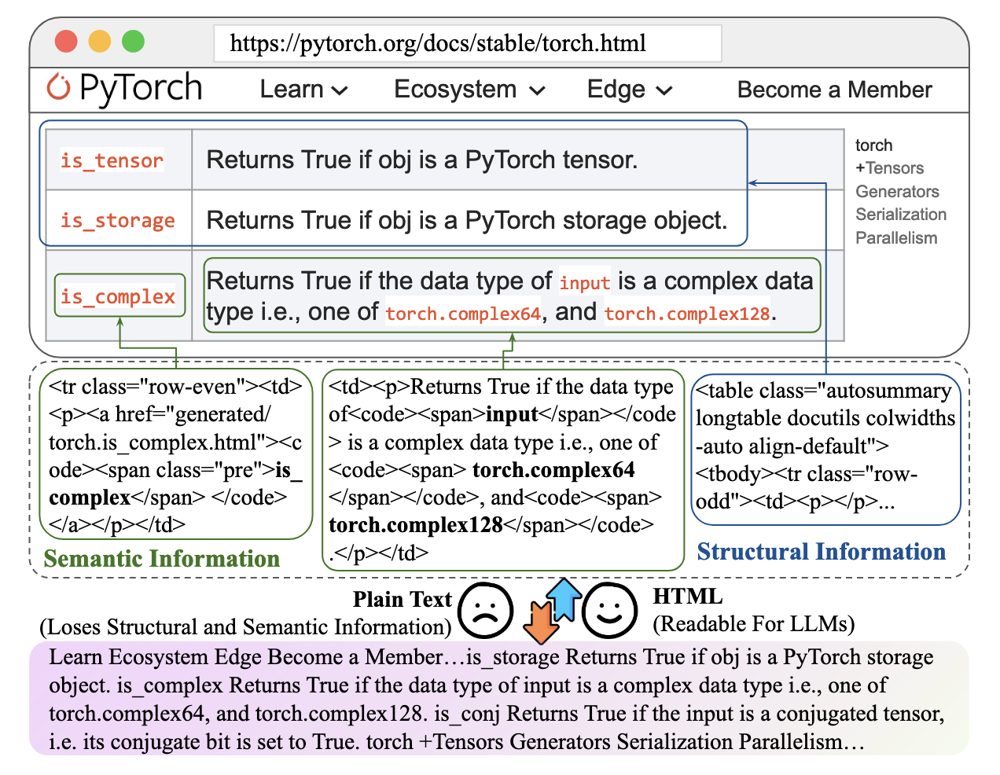
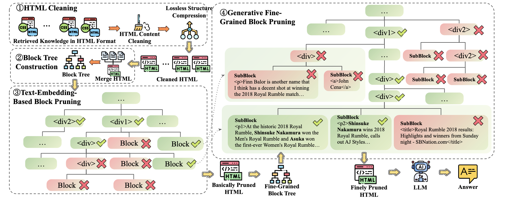

# HtmlRAG: HTML is Better Than Plain Text for Modeling Retrieved Knowledge in RAG Systems
[Jiejun Tan](https://scholar.google.com/citations?user=qHzX-cMAAAAJ&hl=en&oi=sra), [Zhicheng Dou](http://playbigdata.ruc.edu.cn/dou/), Wen Wang, Mang Wang, Weipeng Chen, Ji-Rong We  
https://arxiv.org/pdf/2411.02959
## Introduction
LLMs have demonstrated remarkable capabilities in natural language processing tasks. However, they often struggle with forgetting long-tailed knowledge, providing outdated information, and hallucination.  

RAG systems address these issues by incorporating external knowledge. Traditionally, RAG systems convert HTML to plain text, losing crucial structural and semantic information. This paper introduces HtmlRAG, a novel approach that utilizes HTML as the format for retrieved knowledge, preserving more information and improving RAG system performance.
## Methodology

HtmlRAG tackles the challenge of excessive input length and noisy context in HTML documents. The methodology involves two main steps:  
**1. HTML Cleaning**  
- Removes irrelevant content like CSS, JavaScript, and comments.
- Merges redundant HTML structures without losing semantic information.  

**2. HTML Pruning**
- **Building a Block Tree**: Transforms the DOM tree into a block tree for efficient pruning.
‘’‘python
print

’‘’
- **Pruning Blocks based on Text Embedding**: Removes blocks with low similarity to the user's query.
- **Generative Fine-Grained Block Pruning**: Further refines the block tree using a generative model.
## Experiments and Results
HtmlRAG was tested on six QA datasets, including:  
- **ASQA**: a QA dataset consists of ambiguous questions that can be answered by multiple  answers supported by different knowledge sources;
- **HotpotQA**: a QA dataset consists of multi-hop questions;
- **NQ**:  A QA dataset containing real user’s queries collected by Google;
- **Trivia-QA**: a QA dataset containing real user’s questions;
- **MuSiQue**: A synthetic multi-hop QA dataset;
- **ELI5**: A  long-form QA dataset with questions collected from Reddit forum.  
## Conclusion
HtmlRAG demonstrates that using HTML as the format for retrieved knowledge in RAG systems is more effective than plain text. It retains richer semantics and structure, leading to improved performance. This work opens a new direction for research and provides a simple yet effective solution for processing HTML in RAG systems.
## Future Works
As LLMs continue to evolve, HTML's suitability as the format for external knowledge is expected to grow. Future work may develop better solutions for processing HTML in RAG systems, further enhancing the capabilities of LLMs.