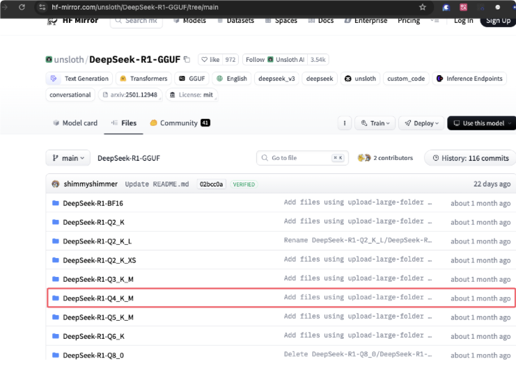
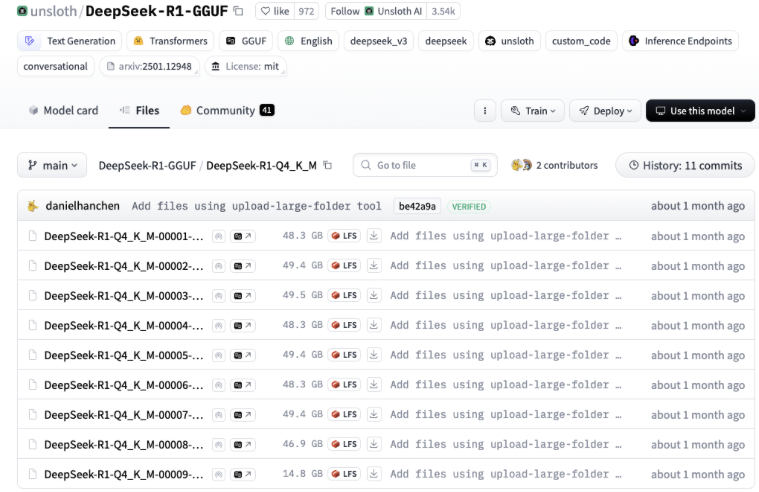
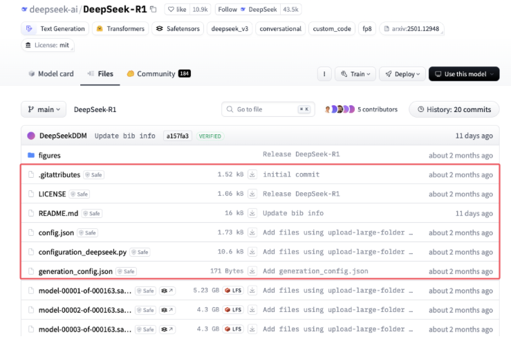
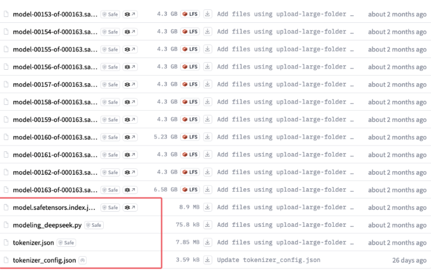
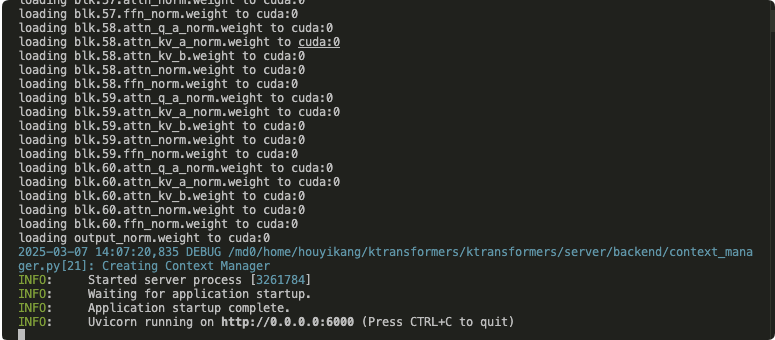

# 二、Ktransformers部署deepseek

1. 创建虚拟环境

   ```
   #创建虚拟环境
   conda create -n ktransforemrs python==3.11
   conda activate ktransformers
   conda install -c conda-forge libstdcxx-ng
   pip install torch torchvision torchaudio 
   pip install packaging ninja cpufeature numpy
   
   #拉取ktransformers源码
   git clone https://github.com/kvcache-ai/ktransformers.git
   cd ktransformers
   git submodule init
   git submodule update
   ```

   **注意**：ktransformers仅支持cuda12.1以上版本

2.编译源码

- 对于Linux系统，使用以下命令：

```
#单CPU
bash install.sh
或者
make dev_install

#双CPU
export USE_NUMA=1
make dev_install或bash install.sh
```

**编译时间大概15分钟左右**

3.下载gguf格式的模型文件（以deepseek-r1 671B 4bit量化版为例）

```
mkdir gguf    #保存gguf格式模型文件
mkdir model   #保存除safetensors格式之外的文件，包括分词器等

```

- 打开镜像网站，找到对应的模型文件





```
cd gguf
pip install -U huggingface_hub
export HF_ENDPOINT=https://hf-mirror.com
```

- 使用py脚本进行下载

```python
# pip install huggingface_hub hf_transfer
# import os # Optional for faster downloading
# os.environ["HF_HUB_ENABLE_HF_TRANSFER"] = "1"

from huggingface_hub import snapshot_download
snapshot_download(
  repo_id = "unsloth/DeepSeek-R1-GGUF",
  local_dir = "gguf",
  allow_patterns = ["*Q4_K_M*"], 
)
#注意修改目录
```

- 下载除模型权重以外的文件，保存到model目录。



  ****



4.运行命令

```
conda activate ktransformers
cd ktransformers

PYTORCH_CUDA_ALLOC_CONF=expandable_segments:True python ktransformers/server/main.py --model_path /md0/home/houyikang/deepseek --model_name deepseek-R1 --gguf_path /md0/home/houyikang/deepseek_gguf/DeepSeek-R1-Q4_K_M  --cpu_infer 63 --max_new_tokens 8192 --cache_lens 32768 --total_context 32768 --host 0.0.0.0 --port 6000 --temperature 0.6 --top_p 0.95 --optimize_config_path ktransformers/optimize/optimize_rules/DeepSeek-V3-Chat.yaml --force_think
```

- --model_path:除了模型权重之外的文件，也就是model文件夹的路径，也可以使用deepseek-ai/DeepSeek-R1(**需要代理**)
- --model_name：模型名称
- --gguf_path ：gguf文件存储的路径
- --cpu_infer：用于推理的cpu核心数
- --max_new_tokens：最大token数
- --cache_lens：缓存长度
- --total_context：上下文长度
- --host：ip地址
- --port：端口


