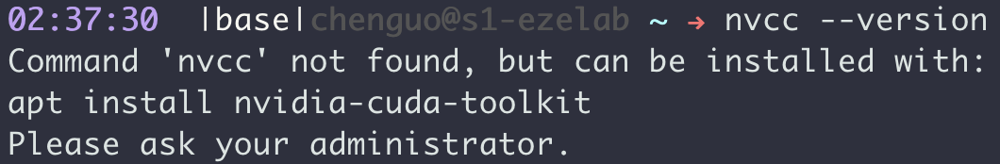
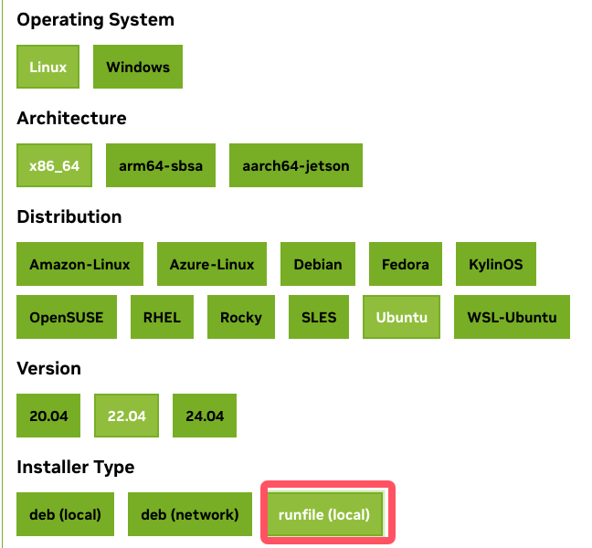
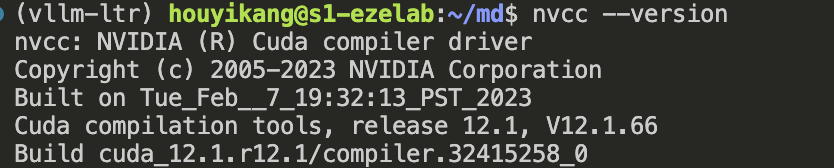

# 解决在没有root权限时，安装CUDA
## 前言
cuda是我们经常用到的工具，在没有root权限时，我们是无法使用sudo apt install nvidia-cuda-toolkit进行安装的。


## 解决方法
首先，进入[Nvidia官网](https://developer.nvidia.com/cuda-downloads),找到对应的操作系统，架构(一般都为x86)，版本号等，Installer Type选择runfile。


选择好之后，在该页面的下方会有一个wget命令，这是用于下载文件的(例如：wget https://developer.download.nvidia.com/compute/cuda/12.6.3/local_installers/cuda_12.6.3_560.35.05_linux.run)。在终端运行该命令即可下载。

**注意**：文件很容易损坏，尽可能的使用wget命令下载

下载好之后，在终端中使用命令安装：

```
mkdir cuda12 #用于存放安装时产生的文件

bash cuda_12.6.3_560.35.05_linux.run --silent --override --toolkit --toolkitpath=/home/houyikang/cuda12 
```
安装好之后，刷新一下目录，有时候不刷新显示不出来。接下来需要设置环境变量，安装产生的文件都存放在cuda12文件夹中。获取该文件夹的位置，环境变量设置如下：

```
export PATH=/home/houyikang/cuda12/bin:$PATH
export CPATH=/home/houyikang/cuda12/include:$CPATH
export LD_LIBRARY_PATH=/home/houyikang/cuda12/lib
64:$LD_LIBRARY_PATH

source ~/.bashrc #使其生效，否则设置的环境变量只是暂时的
```
使用nvcc --version 查看是否安装成功,安装成功会显示类似下图的结果。
