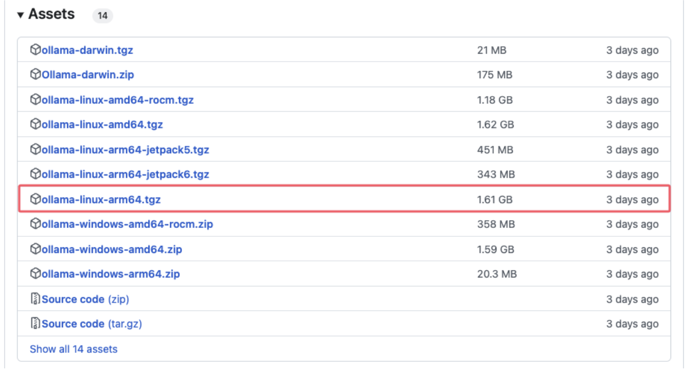
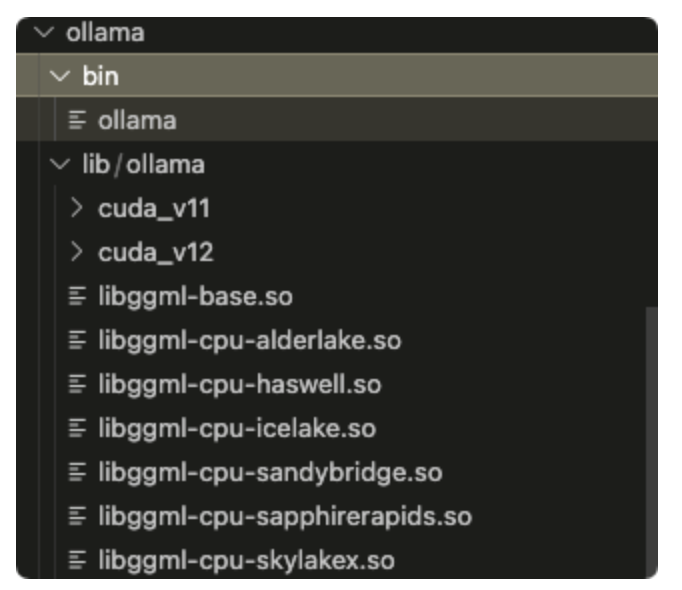

# 服务器没有root权限，安装ollama

1. 首先进行到ollama仓库中(https://github.com/ollama/ollama/releases)选择对应的版本，下载好之后上传到服务器中。



2. 上传完成之后使用命令进行解压，你会得到下图中的文件：

  

   ```
   mkdir ollama
   tar -xzvf 文件名.tgz -C ollama
   ```

3.解压成功之后，打开.bashrc文件配置环境变量

```
export PATH=/md0/home/houyikang/ollama/bin:$PATH
export LD_LIBRARY_PATH=/md0/home/houyikang/ollama/lib:$LD_LIBRARY_PATH

将以上内容添加到.bashrc文件中，注意修改成自己的路径。
source .bashrc
```

4.检查ollama是否安装成功

```
ollama --version
```


5.启动服务并拉取模型

```
OLLAMA_HOST=0.0.0.0:5000 ollama serve 

ollama pull 模型名称
ollama run 模型名称
```

