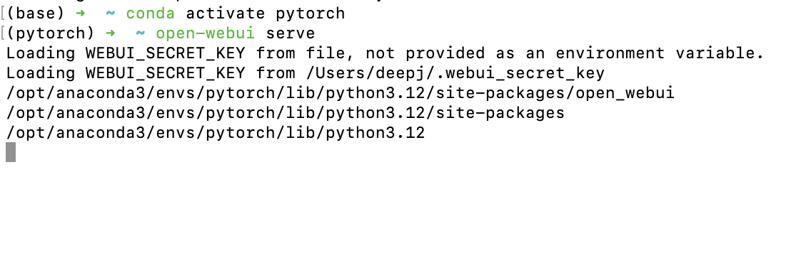
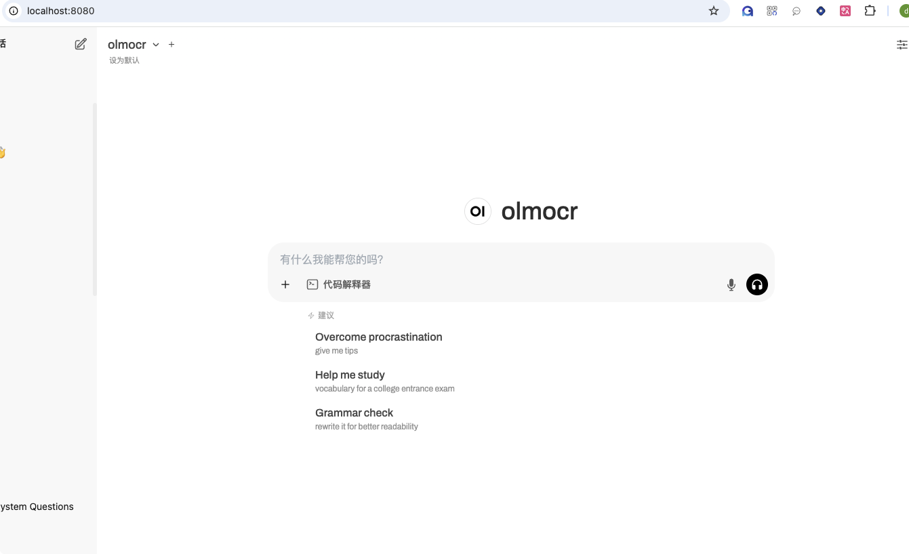
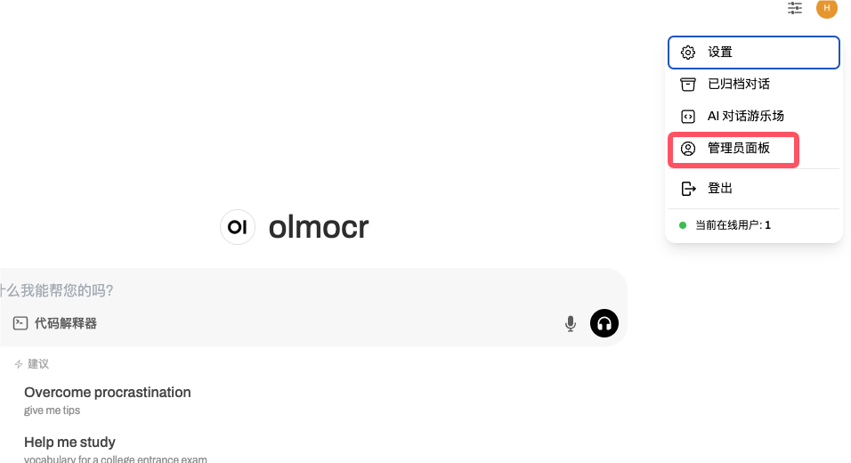
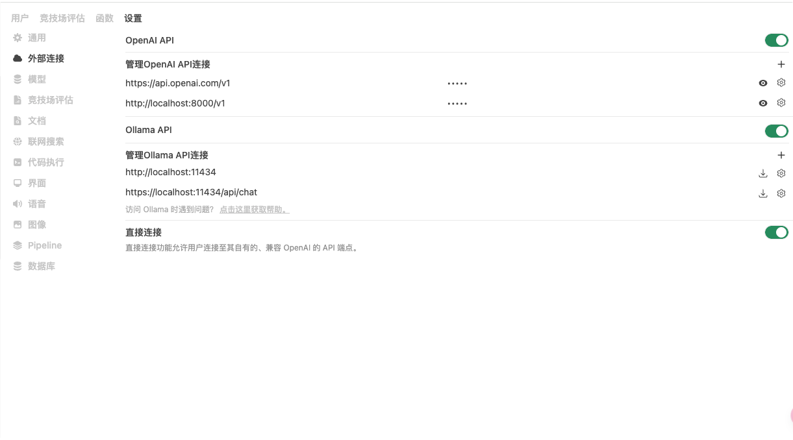
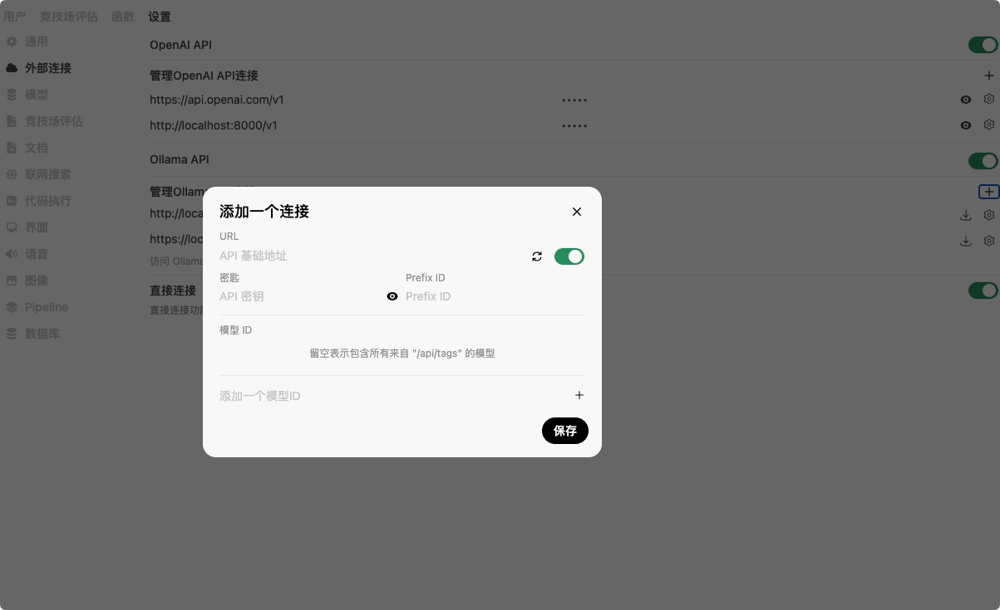

# S2中Gemma3的使用

在S2中已经部署了Ollama，并且开启了自启动，端口默认为11434，需要调用Gemma3的api通过下列方法：

1.首先通过conda安装虚拟环境，python版本最好使用3.10以上，安装命令如下：

```
conda create -n gemma3 python=3.11
conda activate gemma3
```

2.安装openwebui并启动

```
pip install open-webui
open-webui serve
```


在浏览器中输入http://0.0.0.0:8080，打开页面如下：



3.设置api

点击右上角的用户头像，选择管理员面板



选择外部连接，在外部连接中添加Ollama API





如上图，在URL栏中输入http://localhost:11434,密钥没有就随机填一个即可，Prefix ID可不填，模型ID为gemma3，

**注意：** 模型ID一定要填Ollama部署时拉取的模型名称，否则是没有任何作用的。

